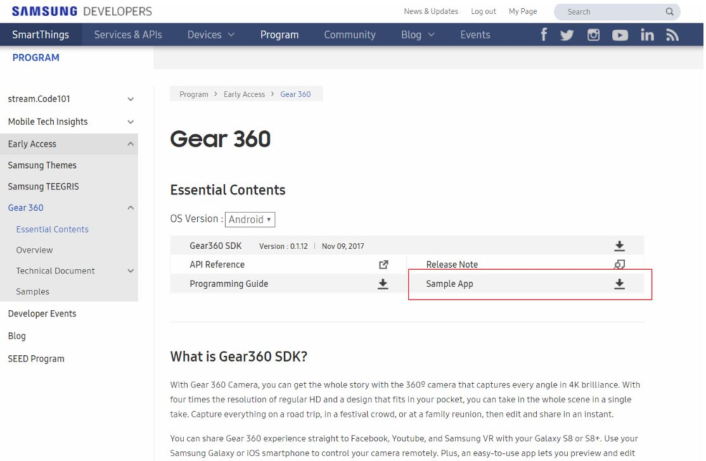
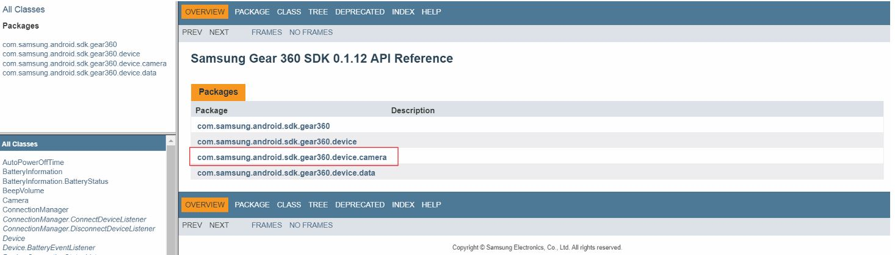
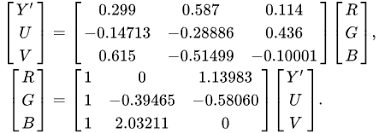
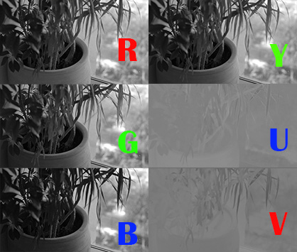

# VICER_360ANDROID

## 소개
* Samsung Gear360 와 연동되는 Android Application으로, 수신받은 frame을 Streaming Server 로 보내준다. 
      

#### 기능
* Gear360 에서 'Image stitching'된 Frame을 디코딩 후에 통신하기 적합한 형태로 인코딩하여 자체 제작된 Streaming Server로 본 프로토콜에서 요구되는 frame으로 추합하여 송신한다.

## 개발환경 설정 실행환경
Android Studio 2.3.3을 사용하여 Samsung Galaxy 7 환경으로 구현하였다. (complieSDK, targetSDK : 25 )

### Android Studio 설치
* 안드로이드 어플리케이션 개발 환경인 안드로이드 스튜디오를 설치하기 위해 아래의 사이트로 들어간다.
* https://developer.android.com/studio/?hl=ko

### JDK
* 다운 하고자 하는 JDK 를 설치하기 위해 아래의 Oracle홈페이지를 들어간다.
* https://www.oracle.com/technetwork/java/javase/downloads/jdk8-downloads-2133151.html
* Java SE Development Kit 8u181 에서 OS에 맞는 버전을 받아 sdk와 마찬가지로 External Tools의 jdk칸에 경로를 설정 해줍니다.

## 기술 설명
* Samsung 측의 권한을 받은 사람에게 제공되는 Gear360 SDK 와 Gear360 Sample App 을 기반으로 제작하였다.

* Samsung 에서 제공하는 Gear360 SDK 를 활용하기 위해서는 관련 당사에서 제공하는 API의 참조 자료를 활용 해야한다. 
   * Samsung Gear 360 SDK 0.1.12 API Reference:(http://img-developer.samsung.com/onlinedocs/gear360/android/)

* 핵심 기능
   * YUV420 format 영상으로 gear360으로 부터 받은 frame을 RGB format으로 변환시켜준다.
      * method in PreviewActivity : public void decodeYUV(int[] out, byte[] fg, int width, int height)
      
  
   * RGB - YUV 비교
   
   
   * 전송 통신 FRAME
   
   
